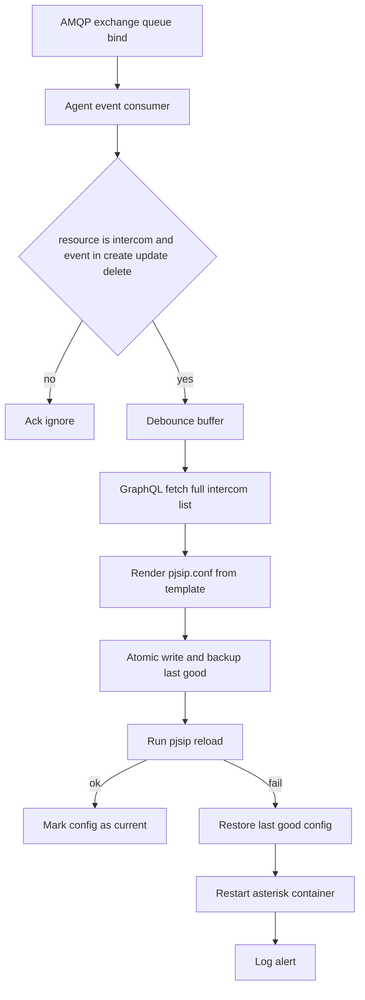

# Intercom Sync Agent Integration Plan

## Objective

Build a Rust sidecar agent that listens to AMQP intercom change events, debounces burst updates, fetches the full intercom list from GraphQL, regenerates `pjsip.conf`, safely applies the config with rollback protection, and updates Asterisk with `pjsip reload` first and container restart as fallback.

## Confirmed decisions

- AMQP and GraphQL are independently configured via environment variables.
- GraphQL requires no authentication.
- Apply strategy: run `pjsip reload` first, restart container only if reload fails.

## Target runtime architecture

## Detailed implementation plan

1. Agent project and runtime contracts
   - Create Rust binary crate in `agent` with modules:
     - `config`: typed env parsing and validation.
     - `amqp`: connection setup, exchange declare, queue declare, bind, consume.
     - `events`: input schema `id`, `event`, `resource` and filter logic.
     - `graphql`: fetch `intercoms { id mac }` snapshot.
     - `render`: deterministic `pjsip.conf` generator.
     - `apply`: backup, atomic replace, reload and rollback.
     - `main`: orchestrator and shutdown handling.
   - Define minimal environment variables with `HEADEND` naming:
     - `HEADEND_URL`
     - `HEADEND_AMQP_EXCHANGE`
     - `HEADEND_AMQP_EXCHANGE_TYPE`
     - `HEADEND_AMQP_QUEUE`
     - `HEADEND_AMQP_ROUTING_KEY`
   - Hardcode shared SIP auth password in code for now:
     - `Sentrics2026`
   - Use internal Rust constants instead of env vars for timing:
     - debounce window `10s`
     - periodic full sync interval `3600s`
   - Hardcode Docker integration values from the existing compose setup:
     - docker host `unix:///var/run/docker.sock`
     - target Asterisk container `asterisk-server`
   - Derive protocol endpoints from `HEADEND_URL` with internal constants:
     - amqp port `5672`
     - graphql port `5000`
     - graphql path `/graphql`
     - example with `HEADEND_URL=myhost` gives AMQP `amqp://myhost:5672` and GraphQL `http://myhost:5000/graphql`
   - Hardcode PJSIP file locations inside the container to reduce config surface:
     - active file `/config/pjsip.conf`
     - last good file `/config/pjsip.conf.last-good`
     - backup directory `/config/backups`

2. AMQP intake and debounce behavior
   - Consume JSON payloads shaped as `{ id, event, resource }`.
   - Trigger sync only when `resource == intercom` and `event` is `create`, `update`, or `delete`.
   - Implement debounce window using a timer reset strategy:
     - Any qualifying event sets `dirty=true` and resets the timer.
     - When timer expires, run one sync for all accumulated changes.
   - Ack strategy:
     - Ack malformed or irrelevant events with warning log.
     - Ack relevant events after marking `dirty=true` to avoid replay storms.

3. GraphQL full snapshot synchronization
   - On each debounced sync, request full list:
     - query `{ intercoms { id mac } }`
   - Validate each `mac`:
     - normalize lowercase.
     - remove `:` to build SIP username and section key.
     - drop invalid records and log count.
   - Sort intercoms by normalized username for deterministic file output.

4. `pjsip.conf` generation strategy
   - Preserve static transport and templates from current structure.
   - For each intercom entry generate:
     - endpoint section using normalized mac as endpoint id.
     - auth section with `username=<mac_no_colon>` and shared `password`.
     - aor section.
   - Include generated header block with timestamp and record count.
   - Ensure output determinism to reduce unnecessary reloads.

5. Safe apply, rollback, and activation
   - Before write:
     - ensure target directory exists.
     - keep dated backup in `/config/backups`.
     - maintain rolling `last-good` copy.
   - Write strategy:
     - write temp file in same filesystem under `/config`.
     - fsync temp file.
     - atomic rename over `pjsip.conf`.
   - Apply strategy:
     - attempt `asterisk -rx pjsip reload` in target container.
     - if reload fails, restore `last-good` and restart container.
     - if restart fails, keep restored file and emit critical log.

6. Docker Compose integration
   - Add `intercom-sync-agent` service with:
     - shared `./config` mount as `/config` for file swap.
     - docker socket mount for reload and restart operations.
     - `network_mode: host` to match local Asterisk networking.
     - dependency on `asterisk` service.
   - Keep both services under `restart: unless-stopped`.

7. Operational hardening and good practices
   - Add periodic full-sync timer as drift correction even without AMQP events.
   - Add startup sync to bootstrap state after container restart.
   - Add idempotency check:
     - hash generated file and skip apply when unchanged.
   - Add bounded backup retention policy.
   - Add structured logs for each phase and failure code path.
   - Add graceful shutdown signal handling.

8. Validation and rollout
   - Local dry run with mocked AMQP event payloads.
   - Verify generated `pjsip.conf` sections for sample mac addresses.
   - Force reload failure test to confirm rollback and restart fallback path.
   - Confirm compose startup order and persistent operation.

## Deliverables

- Rust agent source under `agent`.
- Updated compose service wiring in `docker-compose.yml`.
- Example environment config and README operational steps.
- Rollback and debounce behavior documented with failure scenarios.
